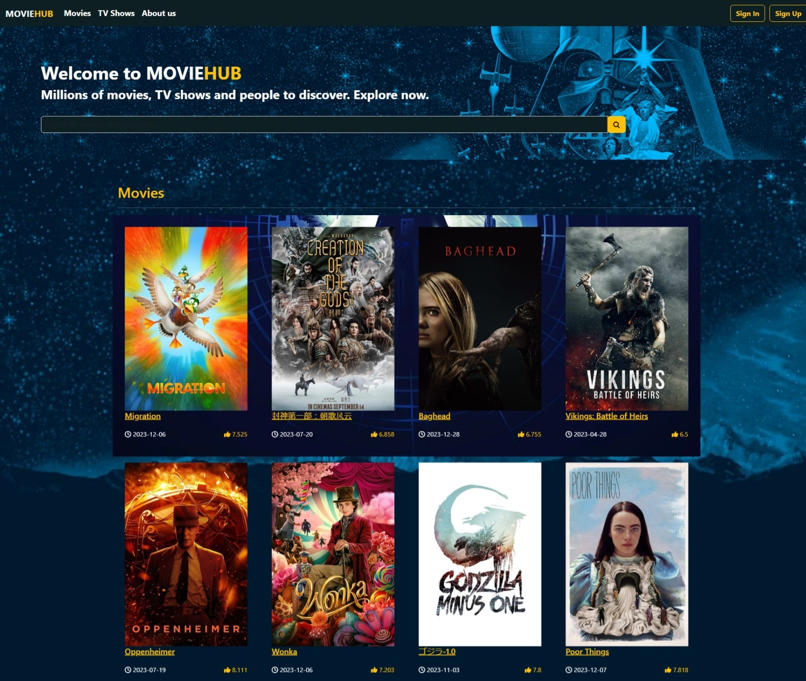

# MovieHub

MovieHub is a free movie-watching website built using React. This repository contains the source code and necessary files to run the MovieHub application.

## Screenshots





## Features

- Browse and search for movies
- Watch movies online for free
- Sort movies by genre, popularity, and release date
- View movie details, including synopsis, cast, and ratings
- Add movies to your favorites list
- Create and manage user profiles
- Leave comments and reviews on movies

## Installation

To run MovieHub locally, please ensure that you have the following prerequisites installed on your system:

- Node.js (version 12 or above)
- npm (Node package manager)

Follow the steps below to set up the project:

1. **Clone the repository:**

    ```bash
    git clone https://github.com/DuyThaiddt/MovieHub
    ```

2. **Navigate to the project directory:**

    ```bash
    cd MovieHub
    ```

3. **Install the dependencies:**

    ```bash
    npm install
    ```

4. **Create a `.env` file in the project root and provide the required environment variables:**

    ```bash
    REACT_APP_API_KEY=your_tmdb_api_key
    ```

   Note: To obtain a TMDB API key, you can sign up for a free account on The Movie Database (TMDB) website.

5. **Start the development server:**

    ```bash
    npm start
    ```

   This command will start the application locally. Open your browser and visit http://localhost:3000 to access MovieHub.

## Contributing

Contributions to MovieHub are always welcome. If you would like to contribute, please follow these steps:

1. **Fork the repository.**
2. **Create a new branch:**

    ```bash
    git checkout -b my-new-feature
    ```

3. **Make your changes and commit them:**

    ```bash
    git commit -m "Add some feature"
    ```

4. **Push to the branch:**

    ```bash
    git push origin my-new-feature
    ```

5. **Open a pull request and provide a detailed description of your changes.**

Please make sure to adhere to the code style and conventions used in the project.
## Acknowledgements

MovieHub makes use of the following open-source libraries and APIs:

- The Movie Database (TMDB)

Special thanks to the developers and contributors of these projects for their valuable work.


## License

The MovieHub is licensed under the [MIT License.](https://choosealicense.com/licenses/mit/)
## Contact

If you have any questions, suggestions, or feedback, please feel free to contact the project maintainer at:

[](https://portfolio.codewithdt.com/)
[](https://www.linkedin.com/in/dduythai/)
[](https://www.youtube.com/@codewithdt)
[](https://www.facebook.com/duythai.ddt/)
[](https://www.instagram.com/dduy_thai/)
[](https://twitter.com/codewithdt)

 
